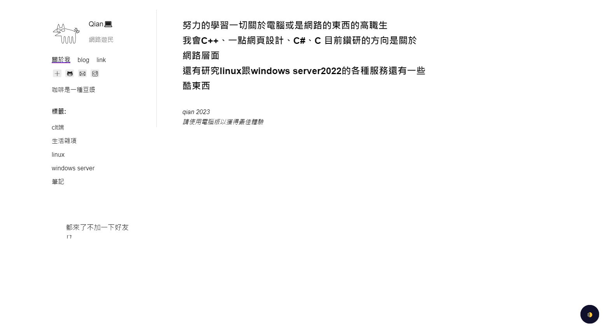

這個網站有製作手機版適配，不過在手機板下頭像會出現被壓縮的情況  

目前網站的圖片

已修改

已修改

現在產文困難

- [x] 標籤頁面 
- [x] 404頁面
- [ ] 分區賽心得
- [ ] 網頁搜尋(已擱置)  
- [ ] 手機版網頁做完
- [ ] 全站點黑暗模式  

##### 2023/3/7:
* ~~計畫把網站模板換成跟bob一樣的，目前遇到的阻礙是不知道怎麼部屬到github 
page上面(已棄用~~

##### 2023/3/8:
* 分區賽之後打算寫一點東西放學習歷程  
* 把原本整體靠左的網頁全部往中間移動一點  
  
##### 2023/3/9:  
* 手機板在瀏覽的時候頭像會被壓縮，推測能是被旁邊的文字壓縮
* 在做post頁面的黑暗模式時候發現黑暗模式按鈕會跟hackmd自帶的小工具衝突，嘗試過把hackmd的小工具去除跟換邊，但是發現hackmd的字體是灰色，切了黑暗模式會看不清因此貼文頁面黑暗模式擱置，要想一個最高效的發布貼文的方法，才不用一直去東改西改  
* 網頁搜尋目前還在研究，不過當務之急是要先解決手機瀏覽頭像被壓縮的問題
修正了有些頁面沒有網頁圖標的問題
* 把404頁面做出來了，不過在貼文裡面404特效出不來
     
   
   
##### 2034/3/10  
* 修改了網頁排版，把自介頁面變成主頁，一點開網站會是自介然後把所有貼文的回到主頁改成回到上一頁，因為如果是回到主頁人機互動會不太好，原本瀏覽的標籤可能要重新找，所以換成上一頁
* 新增了link page 裡面有社交連結跟友站的連結
* 新增了關於我頁面寫了一點東西
* 修正了link頁面黑暗模式切換按鈕沒有emoji的小bug